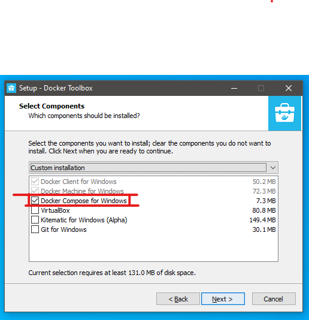

# Installing Docker Toolbox

Docker Toolbox is a legacy version of Docker that runs in VirtualBox. Docker for Windows uses Hyper-V, however if you do not have that enabled you are limited to using Docker Toolbox.

You can download it from here:

[Download Docker Toolbox for Windows](https://github.com/docker/toolbox/releases/download/v18.09.3/DockerToolbox-18.09.3.exe)

Once you run the setup follow the screens to match the options you need to select.

You will need Virtualbox to run this, but you don't need to reinstall it if you already have it.

