# Setting up SQL Server using Docker

## Using docker

Once it is installed, you will need to start the program which will create the VM that you need to run docker.

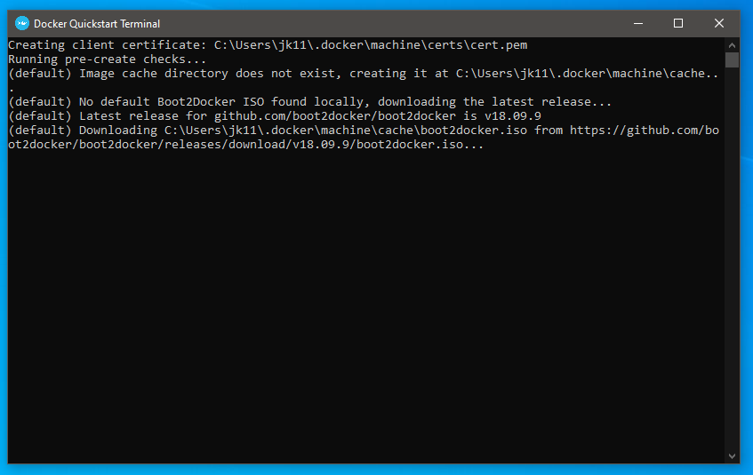

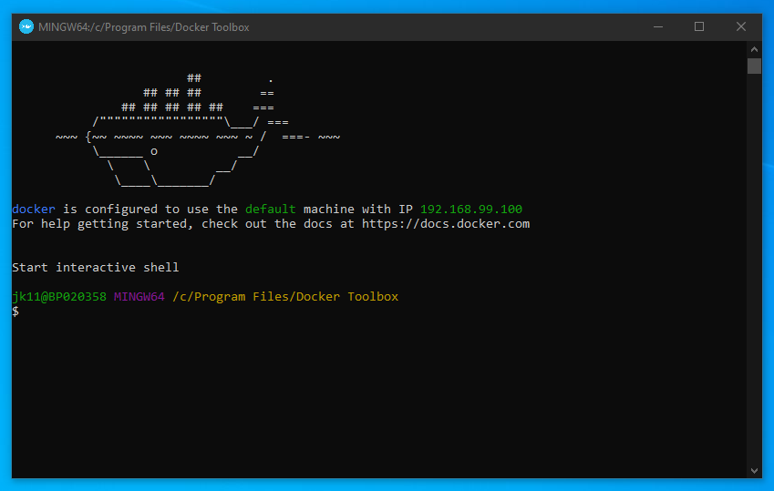

Once Docker has started you will need to pull down the image for SQL SERVER.

```
docker pull mcr.microsoft.com/mssql/server:2017-latest-ubuntu
```

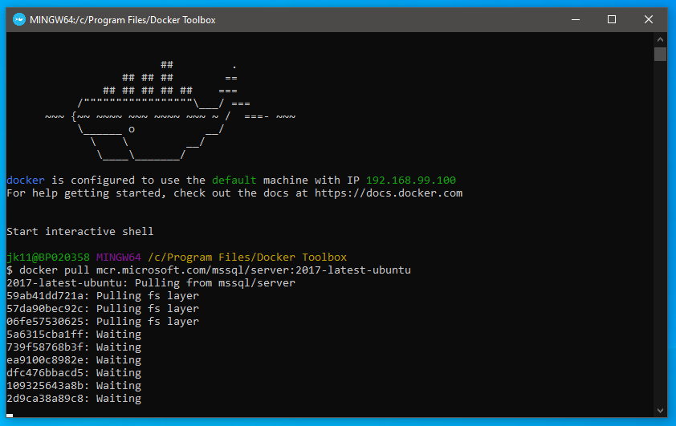

You can see what images you have downloaded using the images command:

```
docker images
```

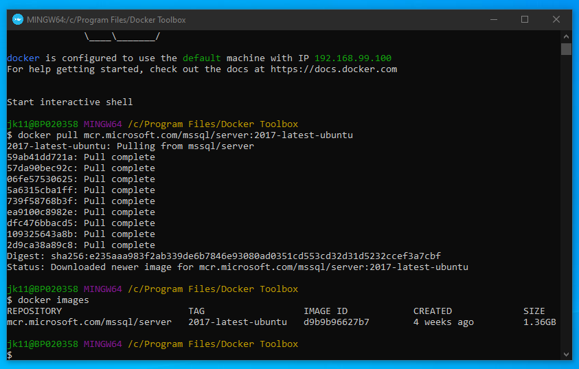

Create and run the container using:

```
docker run -e 'ACCEPT_EULA=Y' -e 'SA_PASSWORD=<YourStrong@Passw0rd>' -e 'MSSQL_PID=Express' -p 1433:1433 --name webapi_mssql -d mcr.microsoft.com/mssql/server:2017-latest-ubuntu 
```

and check the status of it using:

```
docker ps -a
```

to see if it is running.

In  the image below you may see that the container has an 

> Exited (1) x seconds ago

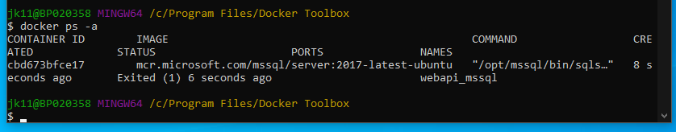

This means that you need to allocate more RAM to your VM - which needs at least 2GB allocated to it.

Type in :

```
docker-machine stop
```

and open Virtual box - and change the value to 2048 MB

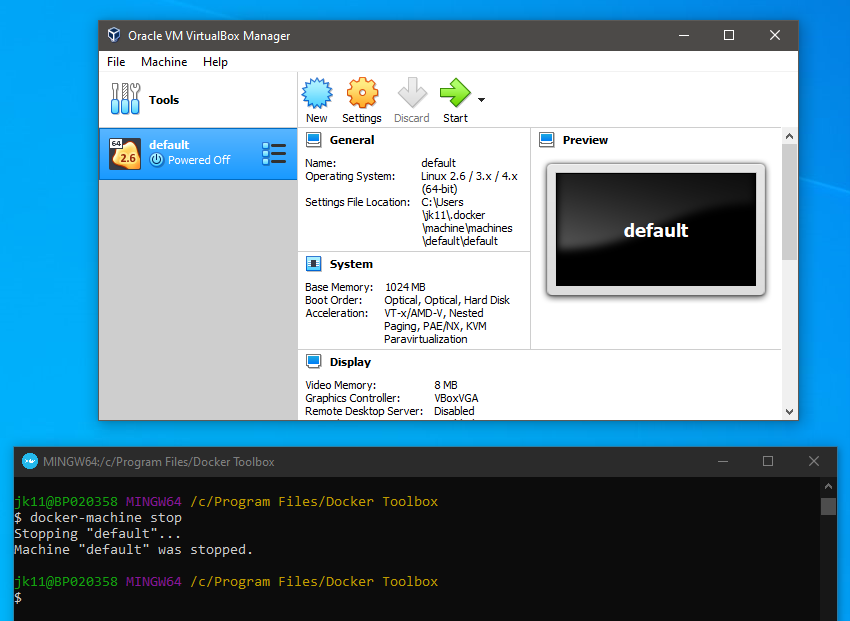

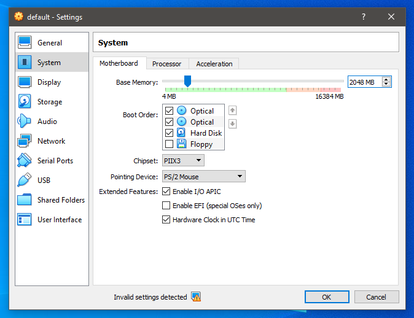

Then start the machine up again using:

```
docker-machine start
```

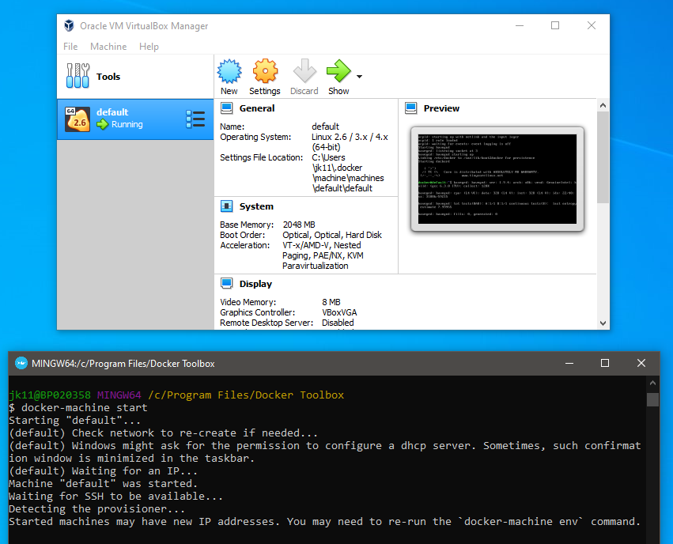

Here is a summary of the commands and you can see that the container is up and running

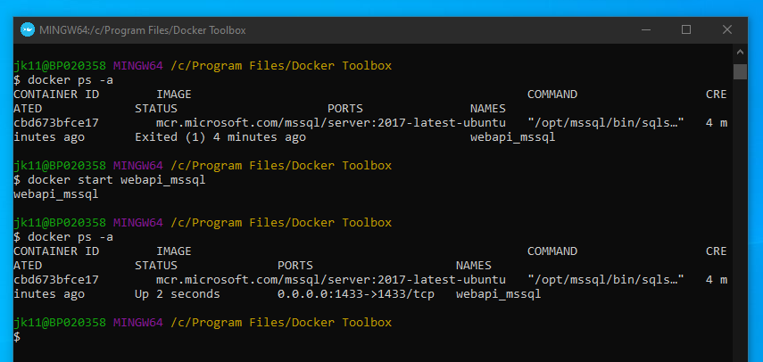

After this you can connect it to a SQL management program, below are some screenshots when using SQL Management Studio

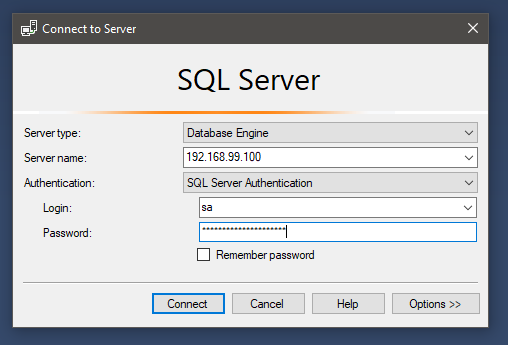

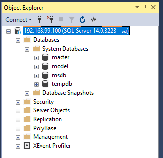

You can now use the docker CLI tool to manage your database as well.

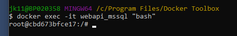

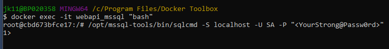

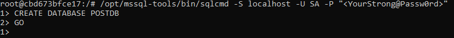

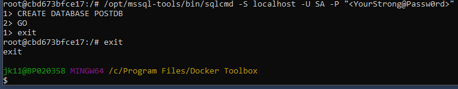


