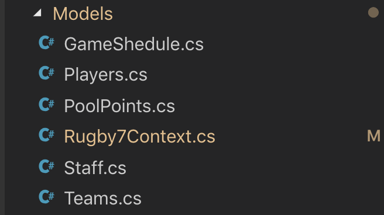

# Exercises

## Exercise 1

The api is not complete, in the demo we looked at the player API, but we still have models for the following tables:

* GameSchedule
* PoolPoints
* Staff
* Teams

Your task is to complete the api so data can be submitted using PostMan.
