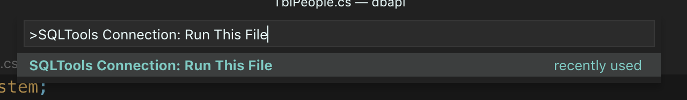

# Project Setup

In this project, we are going to look at how to build a webapi that connects to a MSSQL database.

The idea (and use case) for this api is to be able to connect any (1 or more) application(s) to a database on a remote or local server without having to store any sensitive information within the application itself.

The credentails for the databse will be loaded using environment variables and the system is setup using docker containers, so it is easily deployable.

So let's get started!

!!! attention
    For this tutorial I assume you have the following installed:

    * VSCODE
    * Docker (docker-toolbox or docker for your operating system)
        * You will need to adjust your docker setup or Virtual Box docker VM to support 2GB of RAM to support the MSSQL Server
    * Git (which will give you git bash on Windows)

??? attention "If you do not have docker installed"
    Although the tutorial assumes you use docker, it is only used to run the MSSQL server.  
    If you do not have this option, you will need to do the following:

    * You need to use the Windows operating system
    * Download and install [the express edition of MSSQL Server](https://go.microsoft.com/fwlink/?linkid=853017)

    Your username and password will be whatever you set it to be during the setup process.  

!!! TIP "Installing Docker Toolbox"

    If you are on windows you can install Docker for Windows (Hyper-V based) or Docker for Toolbox (Virtualbox based)

    To install Docker Toolbox for Windows click [here](/docker)

# Create a new project

!!! note "How to use the instructions"

    * When it says "Type in" it means type in the terminal  
    * The `<projectname>` is a placeholder - type in your own name, but do not type in the angle brackets

Not all of these steps are required, but they are useful and they will help you build a good API (and coding habits) - so treat them as if they are all required.

!!! note "If you don't use git"
    Git should be used to manage your code, it is industry standard and in a way the easiest way to manage your code.

    The alternative is for you to keep copying your work into other folders. I am assuming you use git - so if you don't you will need to find your own work around.

Open the Gitbash terminal (from here just reffered to as the terminal) and create your project and navigate to your code folder. (The folder where you store all your projects)

Type in `git init dbapi` to create a working directory with a git repository
  
Go into the folder by typing in `cd dbapi`

Type in `dotnet --list-sdks` to check what versions of dotnet core you have installed on your machine. This is required to see if you need to install the version that this tutorial requires. You should see something like this:

!!! info "Output of dotnet --list-sdks"

    ```  
    $ dotnet --list-sdks
    2.1.505 [/usr/local/share/dotnet/sdk]
    2.2.104 [/usr/local/share/dotnet/sdk]
    3.0.100-preview-010184 [/usr/local/share/dotnet/sdk]
    3.0.100-preview3-010431 [/usr/local/share/dotnet/sdk]
    ```

!!! tip
    You can find all of the dotnet core sdks [here](https://dotnet.microsoft.com/download/dotnet-core)
    But for this tutorial we are working with [this](https://dotnet.microsoft.com/download/dotnet-core/2.1) version.

For this tutorial we are going to focus on version **2.2.x**

Next type in `dotnet new global` to create a **global.json** file that you can use to specify what version of dotnet core you will use for the project.

* You will need to open this file in a code editor and change the version number to the version you have on your machine - it is version 2.2.107

!!! info "global.json"

    ``` json
    {
      "sdk": {
        "version": "2.2.107"
      }
    }
    ```

Save and close the file.

Next create your project by typing in `dotnet new webapi -o api --no-https`

We use the `--no-https` flag, because we are just going to be running this on our own machine. If you forget this option - the project will still work, but you will get a warning in your browser.

!!! note "Using different versions of the sdk"
    If you create the project before the **global.json** change, you will create a project with the newest version and some of the instructions below may not work.

    However if you want to run this project with a later version of dotnet you just need to be aware that you may need to fix up a few minor things later on.

Next you will need to create a **.gitignore** file since we don't want to push all our binary and non essential files into our repository. 

Open the  the [**.gitignore**][3] file from the official dotnet core repository and paste it into your **.gitignore** file.

[3]: https://raw.githubusercontent.com/dotnet/core/master/.gitignore

Back in the terminal start your project by typing in `dotnet run` and view your site by going to [http://localhost:5000/api/values](http://localhost:5000/api/values)

If you see the a json string with:

!!! info "Output of default api"
    ``` json
    [
      "value1",
      "value2"
    ]
    ```

You now have a working api project and we can start making the changes we need to connect it to a database.

!!! hint "Hint for git users"
    * Do an initial commit to your repository type in:  
    `git add .` followed by  
    `git commit -m "Initial Commit"`

    Making regular commits allows you to revert back to previous version of your code if you make an error.

# Setting up the database

At the moment we have installed the dotnet sdk on our machine and this is the easiest since we can just run the `dotnet` commands from our terminal.

However to run a MSSQL Server you will either need to go through a tedious installation process, if you are on a Windows machine or else up until a year or so ago (end of 2017) you were out of luck.

Now Microsoft has embraced the world of containers and it allows us to install it as part of a docker container.

So in your terminal (or docker-toolbox for windows git bash terminal) type the following in to download the 2017 version of MSSQL Server

```
docker pull mcr.microsoft.com/mssql/server:2017-latest-ubuntu 
```

After the download is complete type in:

```
docker run -e 'ACCEPT_EULA=Y' -e 'SA_PASSWORD=<YourStrong@Passw0rd>' -e 'MSSQL_PID=Express' -p 1433:1433 --name webapi_mssql -d mcr.microsoft.com/mssql/server:2017-latest-ubuntu 
```

The password is set to `<YourStrong@Passw0rd>` which is the default password - needless to say, you should probably change this, but it would be bad if I document my passwords here :smile:

??? TIP "Change Database password"

    > The password should follow the SQL Server default password policy, otherwise the container can not setup SQL server and will stop working. By default, the password must be at least 8 characters long and contain characters from three of the following four sets: Uppercase letters, Lowercase letters, Base 10 digits, and Symbols.

    To change the password go to this [link](https://docs.microsoft.com/en-us/sql/linux/quickstart-install-connect-docker?view=sql-server-2017&pivots=cs1-bash#sapassword)

Once that you have run that command, you mssql server is up and running, so let's leave that sitting there for the moment.

??? hint "MSSQL checks"
    If you are running the MSSQL database in Docker, your docker setup needs to have at least 2GB of RAM allocated to it. By default Docker Toolbox only allocated 1Gb to the machine. To fix this do this:

    `docker-machine stop` // this stops the docker machine

    Change the amount of ram using the virtualbox GUI interface from 1024MB to 2048GB

    `docker-machine start` // this starts the docker machine    

    You can now start the database server by typing in:

    `docker start webapi_mssql`

!!! success
    If all of the stuff above went well, you now have your development environment setup. We will talk about setting up the production side of things later, but let's write some code ...

# Populating our Database with some data

We now need to open our project in our code editor. You should still be in your working directory (webapi) so just type in:

``` bash
# if you are already in your project folder
code .
```

This will open the project in Visual Studio Code.

Create a folder called **sql** add 2 files to that folder, call the files **tables.sql** and **data.sql** respectively.

You can view a set of SQL files in the **sourcefiles** folder which is [here].

[4]: /dotnet_core/SQLSVR_WEBAPI/dotnet-2.2.x/sourcefiles/

Copy the contents of the files into your project files.

Before we can add the data, we will need to create a database. You can do this by following these steps:

First (using the terminal) log into the database server:

```bash
docker exec -it webapi_mssql "bash"
/opt/mssql-tools/bin/sqlcmd -S localhost -U SA -P "<YourStrong@Passw0rd>"
```

Then you will need to create the database like so:

```sql
CREATE DATABASE POSTDB
GO
```

Next we need to install some extensions so we can execute code, since vscode detected that you are creating sql files, it may have already prompted you to install it. Since we are working with MSSQL it will be the right extension. (Do not install this extension if you are working with MySQL)

In any case, if you missed the prompt or it didn't happen, you can type this in the terminal to install it.

```
code --install-extension ms-mssql.mssql
```

You will also want to install this extension to manage your database:

```
code --install-extension mtxr.sqltools
```

After the installs are complete, you will need to connect vscode to your database, which you can do like this:

<video src="https://d2ddoduugvun08.cloudfront.net/items/2e2o1g0w3q1e2N111m0r/SQL-SETUP.mov" controls style="display: block;height: auto;width: 100%;">SQL-SETUP.mov</video>

!!! note
    If you are using docker toolbox, then your docker containers are inside of a Virtualbox VM.  

    Instead of typing in localhost, you will need to type in the VM's ip address, which is: `192.168.99.100`

<br>

Once you have the connection setup, go to the sql files and execute them:



Do this for the **post.sql** and then the **people.sql**

You should see the results of the queries pop up in the side pane on the right, which you can close afterwards.

!!! warning
    The above steps assume your database is still running in the docker container. So if you have any errors, check that first by typing in `docker ps -a` into the terminal

Once you have done these steps, you should run a test query on a table you have just created.

Create a new sql file called **test.sql** can paste this code into it.

```
USE POSTDB
GO

-- SELECT * FROM tbl_people
-- GO

-- SELECT * FROM tbl_post
-- GO
```

Uncomment the lines above to run each statement.

# SETUP EF Core (Entity Framework)

Entity Framework is part of the dotnet family and allows for super easy integration of a database to an application, may it be web based or otherwise.

There are 2 approaches you can take:  
1) Code First or  
2) Data First. 

Since we already have a database, let's look at the **Data First** option.

Open the `dbapi.csproj` file inside the api folder and replace the `ItemGroup` tag with the code below.

```
<ItemGroup>
  <PackageReference Include="Microsoft.AspNetCore.App" />
  <PackageReference Include="Microsoft.AspNetCore.Razor.Design" Version="2.2.0" PrivateAssets="All" />
  <PackageReference Include="Microsoft.EntityFrameworkCore" Version="2.2.6" />
  <PackageReference Include="Microsoft.EntityFrameworkCore.Design" Version="2.2.6" />
  <PackageReference Include="Microsoft.EntityFrameworkCore.SqlServer" Version="2.2.6" />
  <PackageReference Include="Microsoft.EntityFrameworkCore.Tools" Version="2.2.6">
    <IncludeAssets>runtime; build; native; contentfiles; analyzers; buildtransitive</IncludeAssets>
    <PrivateAssets>all</PrivateAssets>
  </PackageReference>
</ItemGroup>
```

??? NOTE "What is happening?"

    In the above code we are adding the nuget packages that install entity framework.
    after copy and pasting the code above, you will need to run `dotnet restore`

    If you rather install the packages individually then do the following:

    ```
    dotnet add package Microsoft.EntityFrameworkCore
    dotnet add package Microsoft.EntityFrameworkCore.SqlServer
    dotnet add package Microsoft.EntityFrameworkCore.Tools
    dotnet add package Microsoft.EntityFrameworkCore.Design
    ```

Type in `dotnet restore` to install the nuget packages.

Next we need to create models for the tables in the database, so create a folder called **Models** and then run this command to have it create all the models for you.

!!! note
    You will need to change the credentials to suit your setup.
    The DB Context is related to the sql files above, this would obviously be different if you are working on your own project.

    ```bash tab="Using Docker Native"
    dotnet ef dbcontext scaffold "Server=localhost;Database=POSTDB;User=sa;Password=<YourStrong@Passw0rd>;" Microsoft.EntityFrameworkCore.SqlServer -o Models -f -c PostContext 
    ```

    ```bash tab="Using Docker Toolbox"
    dotnet ef dbcontext scaffold "Server=192.168.99.100;Database=POSTDB;User=sa;<YourStrong@Passw0rd>;" Microsoft.EntityFrameworkCore.SqlServer -o Models -f -c PostContext 
    ```

    ```bash tab="Using SQL EXPRESS"
    dotnet ef dbcontext scaffold "Server=myServerAddress;Database=POSTDB;Trusted_Connection=True;" Microsoft.EntityFrameworkCore.SqlServer -o Models -f -c PostContext 
    ```

In your **startup.cs** file, add the following as your connection string and place it in the `ConfigureServices` under the `services.AddMvc().SetCompatibilityVersion(CompatibilityVersion.Version_2_2);` line paste this:

```bash tab="Using Docker Native"
// Connect to DB
string connection = "Server=localhost;Database=POSTDB;User=sa;Password=<YourStrong@Passw0rd>;";

services.AddDbContext<Rugby7Context>(options => options
        .UseSqlServer(connection)
);
```

```bash tab="Using Docker Toolbox"
// Connect to DB
string connection = "Server=192.168.99.100;Database=POSTDB;User=sa;Password=<YourStrong@Passw0rd>;";

services.AddDbContext<Rugby7Context>(options => options
        .UseSqlServer(connection)
);
```

```bash tab="Using SQL EXPRESS"
// Connect to DB
string connection = "Server=myServerAddress;Database=POSTDB;Trusted_Connection=True;";

services.AddDbContext<Rugby7Context>(options => options
        .UseSqlServer(connection)
);
```

!!! success
    So now that the database and models are setup, we are able to get to coding the API.

We will look at setting up the api controllers in the [next section](/dotnet_core/SQLSVR_WEBAPI/dotnet-2.2.x/02-create-api)