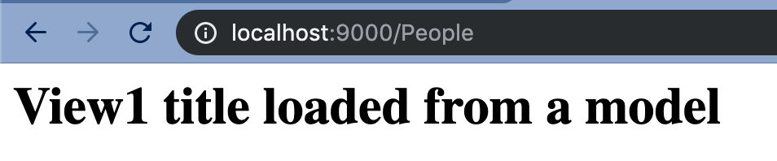

# Creating your first MVC Project

In this exercise you are going to create your first MVC project.

It will include a SQL file, so you don't need to write the code for that.

!!! note "What you need"
    For this exercise I will assume you are working with the following tools:

    * VSCODE
    * Docker (toolbox or native)
    * Web Browser (Chrome)
    * Git (bash or on a native terminal)

    We will make use of the following VSCode Extensions  
    You can install these by typing in `code --install-extension` followed by the name after the colon listed below

    * MySQL: `formulahendry.vscode-mysql`
    * Docker: `peterjausovec.vscode-docker`
    * Docker-Compose: `p1c2u.docker-compose`
    * Browser Preview: `auchenberg.vscode-browser-preview`

    You will also need to be familiar with the documentation in this section.

    * [Part 1 - Setup Docker Container](/php/container_setup/install/)
    * [Part 2 - Setup MVC Framework](/php/mvc_framework/setup/)
    * [Part 3 - Folder Structure](/php/mvc_framework/how-it-works/)
    * [Part 4 - How MVC Works](/php/mvc_framework/mvc/)

Let's get started!

## Setting up your project

Create a project named MVCEX01

Once you have that in place, the outcome should be that you have a folder called **MVCEX01** and in the **www** should be the app and public folder structure from the second `curl` command.

Make sure you have the **.env** file loaded correctly, so that you see the following text on your screen:

`Model does not exists`

At this point you should also have a git repository setup and made your first commit and have it pushed to github.

The workflow above is standard for every project when using frameworks. So if this something that takes you a lot of time, then keep doing it until it becomes part of your project workflow.

!!! hint
    In your www folder there is a folder called **.demo** and this folder has complete working files that make up MVC scenarios.

## Creating a controller

Create a controller file called **People.php** and place it in the **Controllers** folder

Add the basic layout for the controller into that folder.

!!! note ""
    ```
    <?php

    include(APPROOT . '/helper/helperfunctions.php');

    class People extends Controller {

    }

    ?>
    ```

    The **APPROOT** is a constant that points the webserver to the **app** folder. You can see its definition in the **startup.php** file located in the **helper** folder.

    As you may remember from the Controller explaination, the People controller inherits some content from the **Controller** class

In the **People** controller file we are going to add an action. Actions are normal functions and they hold the content that comes in from the model and send the content to the view.

Let's create a simple Index action to begin with:

!!! note ""
    ```
    public function index() {
        return $this->view('people/view1', $data = []);
    }
    ```
If you now navigate to [http://localhost:8000/People](http://localhost:8000/People) (or [http://192.168.99.100:8000/People](http://192.168.99.100:8000/People)) your webpage, you should see the message:

**View does not exists**


(For the attention to detail people, I am running my server temporarily on port 9000, but everything else works the same)

In the views folder create a folder called people and inside of that create a file called called **view1.php** .

In the **view1.php** file, just write 

```
<h1>Hello View1</h1>
```

and save the file. After refreshing the page you should now see this:


## Creating the model

Inside of the class need to point to a model, since we are going to be using a database. So for now, just create a file called **_People.php** (Note the underscore) inside of the Models folder.

In the People Controller add this piece of code, above the index action.

!!! note "Class contructor"
    ```
    public function __construct() {
        $this->people = $this->model('_People');
    }
    ```

At this stage, if you refresh the page, you will see that you have an error that says it can't find the model class.

In the **_People.php** file, add the base code for a model which is:

!!! note "Base Model"
    ```
    <?php

        class _People {

            public function title() {
                return "View1 title loaded from a model";
            }
        }
    ?>
    ```

    !!! warning
        Your class name MUST BE the same name as the file name, as the system looks for both.

In the model above you can see that we have created a function for the title.

Let's add that to our controller.

## Adding the model to the controller

Update the index action to look like this:

!!! note "Updated index action"
    ```
    public function index() {

      $title = $this->people->title();

      $data = [
        'title' => $title
      ];

      return $this->view('people/view1', $data);
    }
    ```

Next we need to reference that `$title` variable in the view.

## Displaying the model in the view

Open up the **view1.php** and replace the current code with this code:

!!! note "Loading the view"
    ```
    <?php

        echo '<h1>'.$data['title'].'</h1>';
    ```

    In the code above we type in our HTML code - HTML code is never typed in the model, but only in the view.

    The fullstop is the php character to concatenate strings.

    As you can see we are adding the `$data` associative array (which is also called a dictionary) and use the key that was set in the controller to access the data.
    In this case `$data['title']` is just a string, so it is pretty easy.
    
You should now see this:



In [exercise 2](/php/mvc_framework/exercise-2) we will add data from the database to the view.