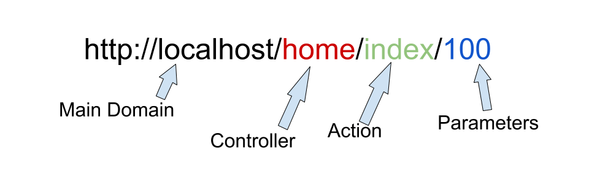

## APP : Models - Views - Controllers

To know what we are working with, let's define what each of these files do.


As you can see in the image above, the user uses the a website, by navigating to it. Once they are on that website, the different pieces come together.

The Controller is in a way the glue to the process and so a couple of things need to be remembered.

* The controller communicates to the model
* The controller communicates to the view
* The model **NEVER** communicates to the view.
* Whatever data the model has, is send to the controller
* Whatever view there is to display the data is selected by the controller.

So by those rules that are shown above, the starting point for any page would be the controller.

## THE URL Format

When you look at a url for a website you will see the following format:



* The default controller for this framework is called **Pages**
* The default for index for this framework is called **Index**
* There is no default value for the parameter, since it only applies when you need a specific record for something.

Now there are 2 ways you can set this up:

You either create a tonne of controllers and give them each a single action or - and this is the way we will do it - you create a single controller for each function and give them each the appropriate methods in relation to the CRUD acronym.

So each **Controller** will get at least a single actions with a maximum or 5 actions.

## The Controller

The format of a controller looks something like this to begin with:

!!! note "A basic controller"
    ```
    <?php
        include(APPROOT . '/helper/helperfunctions.php');

        class Pages extends Controller {

            public function __construct() {
                $this->people = $this->model('People');
            }

            public function index() {
                // Links to model
                $people = $this->people->getAllPeople();
                $title = $this->people->title();
                $data = [];

                // Send data to View
                $this->view('pages/index', $data = []);
            }
        }
    ?>
    ```

These are not auto-generated, but you can just copy this code and modify it to what you need.

Let's break it up into parts:

??? note "Import the helper functions"
    Import the helper functions so you can manipulate the URL

    ```
    include(APPROOT . '/helper/helperfunctions.php');
    ```

??? note "Create the contoller class"
    Create the class - this name has to be unique within your project and the file in which it is created must have the same name.

    The `extends` keyword means we are inheriting from the Controller class

    All the other content goes inside of it.
    
    ```
    class Pages extends Controller {
      ...
    }
    ```

??? note "The constructor - setting the model"

    In the class constructor we set the name of the model(s) we need to interact with. If you don't need a model, because your data is **static** - then you can omit this.

    You can also specify multiple models inside of the one controller, but we will look at that later on.

    The name of the model **MUST BE** the same name as the model file name as it looks for the file name.

    ```
    public function __construct() {
      $this->people = $this->model('People');
    }
    ```
??? note "The Action"

    The actions are part of the URL and since index is the default action, it will be needed for setting up controller only URLs.

    In the first part we setup all the data we need to get from our model(s), this are basically functions that request data from the database and save the result (an array) into a variable.

    These variables can hold anything - it doesn't have to be a function.

    The first part of the `view()` method is the link to the folder inside of the **views** folder and then the filename. The file name is the name of actual file in the views folder and has nothing to do with the name of the endpoint.

    The files may also be called template1, template2 etc.

    ```
    public function index() {
        // Links to model
        $people = $this->people->getAllPeople();
        $title = $this->people->title();
        $data = [];

        // Send data to View
        $this->view('pages/index', $data = []);
    }
    ```

    The $data array (which must be included) is used to pass in all the variables you create to the view, so you may end up with something like 

    ```
    $this->view('pages/index', $data = [$people, $title]);
    ```
    or just an empty array, which is passed down by default.

## The Model

In the models folder, we have all our models. A model is the part that queries, sends and receives the data from the database.

A model is usually closely associated with a controller, as far as the name goes, but:

* It cannot be the same name - using an underscore in the name is enough.

* It should be descriptive of what you type of data you want, so it is easier to get to later.

The format of a model looks something like this to begin with:

!!! note "A basic model"

    class People {

        private $db;

        public function __construct() {
            $this->db = new Database;
        }

        public function title() {
            return "Show All People";
        }

        public function getAllPeople() {
            $this->db->query('SELECT * FROM tbl_people');
            return $this->db->resultSet();
        }
    }

Again these are not auto-generated, but you can just copy this code and modify it to what you need.

Let's break it up into parts:

??? note "The model class"

    The class contains all of the methods - it doesn't inherit from anyting.

    ```
    class People {
      ...
    }
    ```

??? note "Link to Database"

    The model is the part that communicates to the database, so it needs to setup a new instance of the object.

    ```
    private $db;

    public function __construct() {
        $this->db = new Database;
    }
    ```
??? note "The queries"

    Below you will see 2 queries, one returns a string and the second one does a query to a database.

    ```
    public function title() {
        return "Show All People";
    }

    public function getAllPeople() {
        $this->db->query('SELECT * FROM tbl_people');
        return $this->db->resultSet();
    }
    ```

??? note "Query with a parameter"

    Queries can be as complex as you require them to be, but and any parameters are binded into the query. They are not directly hard coded into it.

    For each paramter for a query query, you need to pass in the parameter as a php variable, since you do not know what the value will be at development time.

    Since we don't know the value, we need to sanitize these variables and we that with the `bind()` function.

    As you can see the parameter in the query is identified with a `:` and in the binding function it is mapped to the variable name.

    When doing a Select query, we then return the result as per normal, which gives an array - even if the array only has a single item in it.

    ```
    public function getSinglePerson($id) {
        $this->db->query('SELECT * FROM tbl_people WHERE ID = :id');
        $this->db->bind(":id", $id);
        return $this->db->resultSet();
    }
    ```

??? note "INSERT / UPDATE / DELETE with a parameter"

    For the C UD and type queries, we need to pass in paramters as and they work exactly the same

    ```
    public function addPerson($fn, $ln, $dob) {
      $this->db->query('INSERT INTO  tbl_people (FNAME, LNAME, DOB) VALUES (:fn, :ln, :dob)');


      $this->db->bind(':fn', $fn);
      $this->db->bind(':ln', $ln);
      $this->db->bind(':dob', $dob);

      if($this->db->execute()) {
          return true;
      } else {
          return false;
      }
    }
    ``` 

    As you can see we pass in 3 parameters and sanitize each of them. 

    At the end, we check if the database was successfully changed by returning a simple true / false boolean.

## The View

In the views folder we have all the templates. Now each of the view templates can be used multiple times and have a different way of processing the data coming in.

!!! hint "TIP => Example"
    You may have a single template that has 2 columns, but how the data comes into those columns is different, therefore you need multiple versions of that one template.

!!! hint "HINT => Use the controllers as folders"
    To make it easier to find the templates to use for each controller, create a folder that has the name of the controller and put the template files that are needed for each controller in there.

You will need to the path to the view file in the controller:

!!! note ""
    ```
    $this->view('folder_name/view_template', $data = []);
    ```

The view file, although it ends with a **.php** extension, most of it is HTML.

The format of a model looks something like this to begin with:

!!! note "Format of View"

    ```
    <?php include(APPROOT . "/views/includes/header.php"); ?>

    <div class="row">

    </div>

    <?php include(APPROOT . "/views/includes/footer.php"); ?>
    ```

The `class="row"` is a reference to using bootstrap, but it could be anything.

You will notice there are 2 files, a **header.php** and a **footer.php** file.

I tend to put them in the a folder called **includes** which you can see from the path that is used.

In the **header.php** file we include everything from the top `<html>` tag to the where the commonality of each page ends. 

So a header for a page could look like this:

<script src="https://gist.github.com/to-jk11/b6c2c64e72dac34e4332bcf24b9afda4.js"></script>

The **footer.php** file includes everything from where the first tag of a view ends and the common footer for each page starts.

So a footer for a page could look like this

<script src="https://gist.github.com/to-jk11/c297e7ebf9468c9c637f8ba232b87565.js"></script>