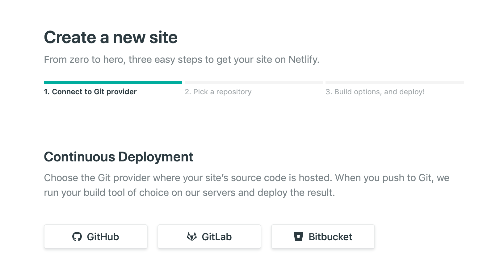
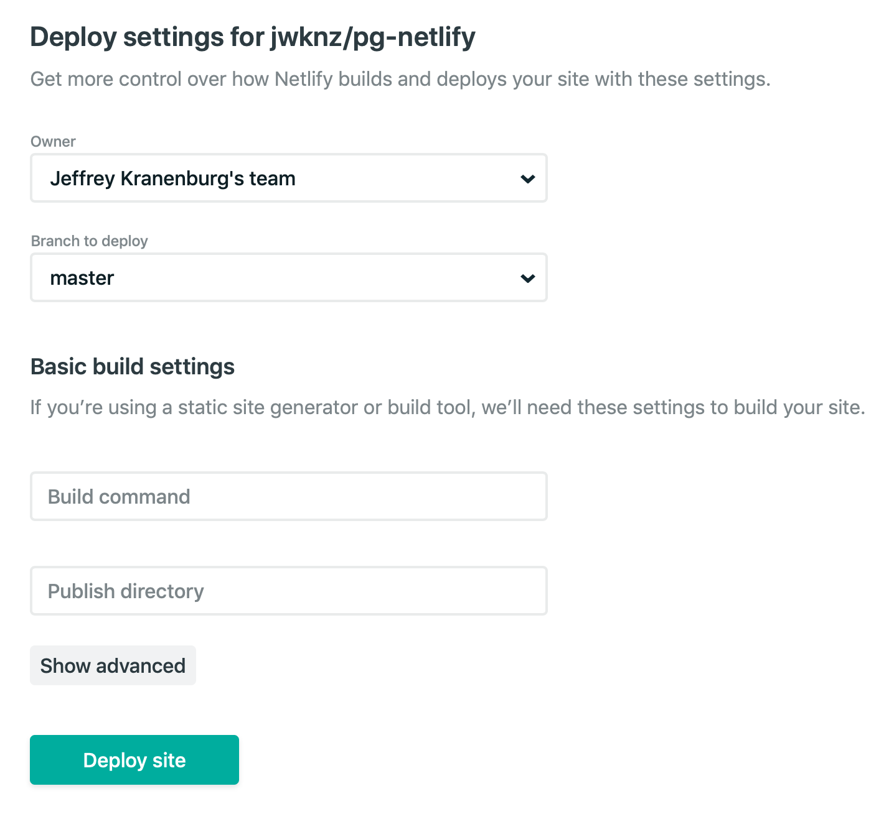

# Pushing our code to GitHub

In order for CI to work, we need a repository - so let's push our code up to GitHub.

Go to [http://github.com/new](http://github.com/new) page and create a new repository - I have called it pg-netlify, but call it whatever you want.

In your repository link the remote repository to your local project by typing the following into the terminal:

```
git remote add origin https://github.com/<username>/pg-netlify
```

Push your code to GitHub:

```
git add .
git commit -m "Initial Commit"
git push origin master
```

You may be prompted to type in your credentials, so do so if required.

Once the code has been pushed, you should be able to see the files after refreshing the GitHub page.

# Setting up Netlify

Netlify is a service that allows to host our website for free (they use a freemium business model, which is nice in our case).

Go to [Netlify.com](https://netlify.com) and sign up for an account - you can use your GitHub account for a SSO option.

Once it is setup, you can click the "New site from GitHub" button, which is on the right and a teal colour.

You then see the following screen, where you can click on the GitHub button:



A pop up screen will come up (check if your browser is blocking it) and go through the motions of authenticating your GitHub account and give it access.

After you have completed this, you should be able to search for your repository.

Once you have found it, select it and you should see the following screen:



Just click the "Deploy Site" button - if the future you will add the Build Command, but for now let's ignore this.

You site will be deployed and after a few seconds you should be able to preview your site.

If all goes well, the console in the browser should say "Site is Live" 

Click on the preview button towards the top and you should see the website, but you may notice something is missing....

This is what we are going to fix on the next page:
